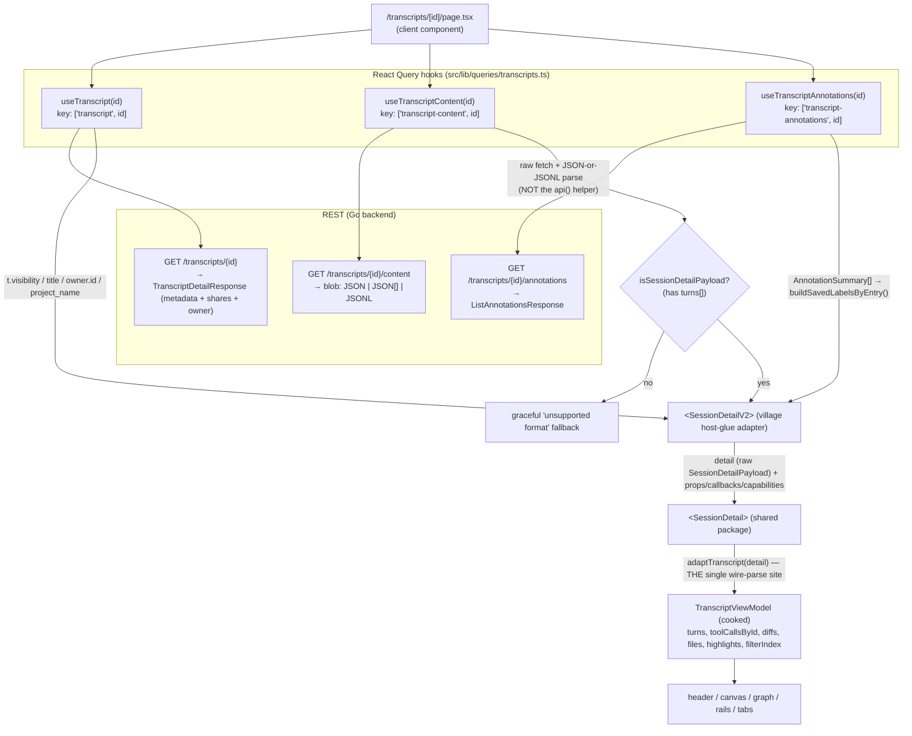
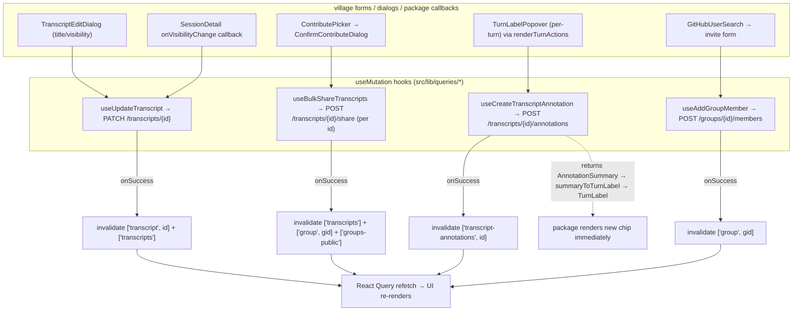
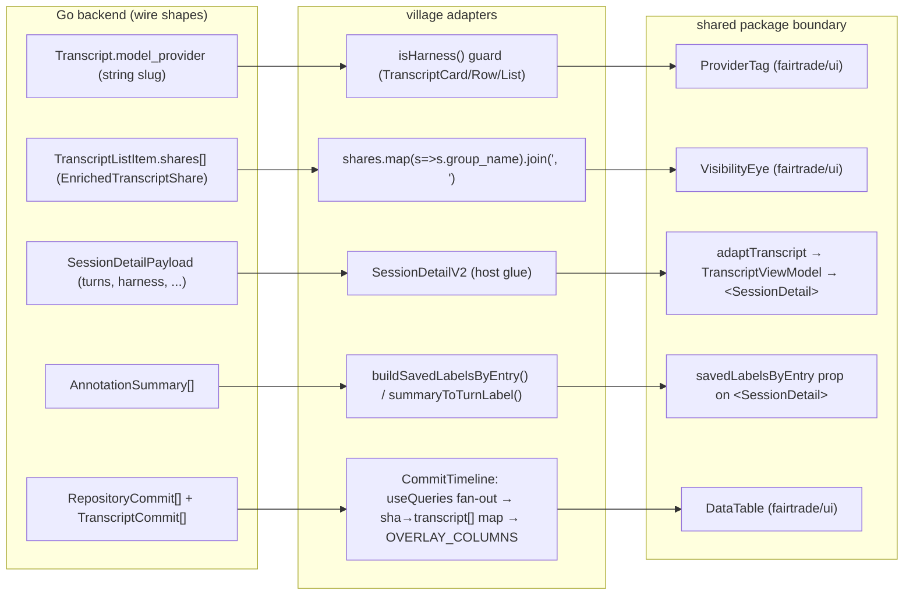

# Village frontend — Data-Binding Architecture

How data flows from the Go backend to the rendered UI in `village/frontend`, and
back for mutations. Grounded in the code under `frontend/src` and the published
`@peasant-labs/transcript-browser`, `@peasant-labs/fairtrade`, and
`@peasant-labs/schema` package boundaries.

This documents **what exists and why**. It does not propose new view-models or
refactors.

---

## 1. Overview

Village is a Next.js (App Router, React 19) client over a Go REST API. There is
**no WebSocket** in the frontend — every read is an HTTP `GET` cached by React
Query, every write is an HTTP mutation that invalidates cache keys. (Contrast
with peasant, which pushes the same `SessionDetailPayload` over a WebSocket
`session_detail` channel — see §4.)

Data moves through these layers, top (network) to bottom (pixels):

1. **REST transport** — `src/lib/api.ts`. A single `api<T>()` helper wraps
   `fetch`, attaches a Bearer token read from the `peasant_token` cookie, and
   throws a typed `ApiError` (carrying the HTTP `status`) on any non-2xx.
   `API_URL` is `NEXT_PUBLIC_API_URL` (default `https://localhost/api/v1`).
   - `src/lib/api.ts:30` — `api<T>()`
   - `src/lib/api.ts:10` — `ApiError` (status-carrying)
   - `src/lib/api.ts:24` — `getToken()` (reads `peasant_token` cookie)

2. **Fetch/cache layer** — `@tanstack/react-query`, one `QueryClient`
   (`src/providers/QueryProvider.tsx`, `staleTime: 30s`, `retry: 1`). Hooks live
   under `src/lib/queries/*` (one file per resource: `transcripts`, `groups`,
   `auth`, `repositories`, `attestations`, `orgs`, `tags`). Each hook owns its
   **query key** and its **invalidation** policy.

3. **Adapter layer** — two distinct *kinds* of adapter (this is the central
   architectural fact, see §3):
   - **One cohesive wire→view-model projection** for the transcript trace:
     `adaptTranscript()` → `TranscriptViewModel`. It lives in
     `@peasant-labs/fairtrade/ui` and is called **inside** the shared
     `transcript-browser` `<SessionDetail>` composer (not in village). Village's
     `SessionDetailV2` is the **host-glue adapter** that feeds the REST payload,
     auth, and mutations into that package.
   - **Distributed, tiny per-component prop-adapters** for the heterogeneous
     "chrome" (cards, rows, tables, tags, eyes). Each maps one backend wire
     field to one component prop, inline at the call site.

4. **View-model / component layer** — the shared `<SessionDetail>` package
   renders the trace from the cooked `TranscriptViewModel`; village's own
   components (`TranscriptCard`, `CommitTimeline`, `VisibilityEye`, …) render
   the chrome from village wire types.

The **write path** is uniform: a form/dialog calls a `useMutation` hook from
`src/lib/queries/*`; the `mutationFn` issues the HTTP verb via `api()`; `onSuccess`
**invalidates** the affected query keys (refetch-driven), occasionally
`setQueryData` for instant cache writes (auth only). There is little true
optimistic UI — the one notable exception is per-turn label save, which returns
the persisted record to the package so it renders the new chip immediately.

Provider mounting order (`src/components/LayoutShell.tsx`):
`QueryProvider → AuthProvider → (UsernameGate, Navbar, children)`. So the React
Query cache wraps everything, and `AuthProvider` (which itself is just a context
over the `useMe()` query) is available app-wide.

---

## 2. Diagrams

### (a) READ data-flow — the transcript detail page

Key point: village hands the package the **raw** `SessionDetailPayload`. The
*sole* wire→view-model projection (`adaptTranscript`, which `JSON.parse`s tool
`arguments`/`result`, computes diffs, rolls up files) happens **once, inside the
package** — `SessionDetail.tsx:218-221`.

### (b) WRITE / mutation flow

Pattern: **invalidate-then-refetch** is the default. `setQueryData` (true cache
write, no refetch) is used only in `auth.ts` (`useSetUsername`,
`useUpdateMySettings` write the `['me']` cache directly). The label-save path is
the only place a mutation's *return value* drives an immediate render (the
package gets the persisted `TurnLabel` back).

### (c) Adapter-boundary map

---

## 3. Adapters

### 3.1 The one cohesive view-model adapter (transcript trace)

There are really **two components named like adapters** on the transcript path;
keep them straight:

**`SessionDetailV2` — village's host-glue adapter** (NOT a data transform).
`src/components/session-detail/v2/SessionDetailV2.tsx`.

- **Input**: props from the route —
  `detail: SessionDetailPayload | undefined` (the React Query content blob),
  plus `transcriptId / transcriptVisibility / transcriptTitle /
  transcriptOwnerId / projectName / error` (from the `useTranscript` metadata
  record). (`SessionDetailV2.tsx:29-44`.)
- **Output**: it renders the shared `<SessionDetail>` and wires:
  - host-derived props it computes — `phases = detectPhases(detail.turns)`
    (`:84`), `annotations = annotateTranscript(detail.turns)` (`:85-88`),
    `savedLabelsByEntry = buildSavedLabelsByEntry(annotationsQuery.data)`
    (`:91-94`);
  - `capabilities` gated by **village auth/ownership** (`isOwner`, `canLabel`,
    `canContribute`) — the package never reads auth (`:178-185`);
  - `callbacks` (`onEdit`, `onContribute`, `onVisibilityChange`, `onLabelSave`)
    that open village dialogs or fire village mutations (`:186-201`);
  - `linkBuilder` / `sessionLinkBuilder` for village's URL shape
    (`/transcripts/{id}?turn=N`) (`:146-155`);
  - `renderTurnActions` mounting village's `TurnLabelPopover` (`:162-171`).
- **Why it exists**: the docstring (`:46-53`) states it plainly — village owns
  the *app glue* (REST data layer, auth/ownership, phase detection, edit/
  contribute mutations + dialogs) and feeds it into the package; the package owns
  **all** rendering and view state. "There is no village-specific viewer code…
  every UI primitive comes from the package." It is the seam between village's
  data world and the framework-agnostic viewer's prop/callback contract.

**`adaptTranscript` — the actual wire→view-model projection.** Exported from
`@peasant-labs/fairtrade/ui`; called inside the shared
`transcript-browser/.../SessionDetail.tsx:218-221`, **not** by village.

- **Input**: `TranscriptWireInput` ≈ the raw `SessionDetailPayload`
  (`{ ...detail, turns }`).
- **Output**: `TranscriptViewModel` — the cooked model every dumb transcript
  component renders:
  `session`, `turns: TurnVM[]`, `toolCallsById: Map`, `diffs`, `files`, `tasks`,
  `highlights`, `filterIndex`, optional `analytics`
  (`fairtrade/dist/lib/types/transcript/view-model.d.ts`).
- **What it does**: per the docstring it is *"the SOLE wire-parse + git-drift
  normalisation site"* — it parses each tool call's `arguments`/`result` JSON
  **once**, derives previews, classifies `kind`/`group`, computes diffs/hunks,
  aggregates per-file churn, and tolerates both git wire shapes. Components then
  **never `JSON.parse`** (`SessionDetail.tsx:210-217`, `:222-228`).
- **Why ONE cohesive adapter here**: the transcript trace is a single, large,
  homogeneous, deeply-nested document rendered by a whole subtree of components
  (canvas, graph, diffs, files, rails). Parsing the wire once into a shared
  cooked model — with `toolCallsById` giving shared object identity — means the
  expensive parse happens exactly once and every component reads cooked fields by
  index. That is exactly the case where a single fat view-model pays off, and
  it is owned by the shared package so village and peasant agree on the shape.

Supporting per-detail adapters village runs before handing off:

| Adapter | Input → Output | File:line | Why |
|---|---|---|---|
| `buildSavedLabelsByEntry` | `AnnotationSummary[]` (wire) → `Map<number, TurnLabel[]>` | `src/lib/annotations.ts:121-133` | The package's `savedLabelsByEntry` prop expects entry-indexed `TurnLabel`s; session/project-level rows are dropped. |
| `summaryToTurnLabel` | `AnnotationSummary` → `TurnLabel \| null` | `src/lib/annotations.ts:106-115` | Single wire-row→package-label map; also used to echo a freshly-POSTed label back to the package (`SessionDetailV2.tsx:98-107`). |
| `detectPhases` | `TurnDetail[]` → `Phase[]` | `src/lib/insights/*` (called `SessionDetailV2.tsx:84`) | The package renders phases but never derives them (host supplies). |

### 3.2 Distributed per-component prop-adapters (the chrome)

These are small, local, single-field maps — usually one inline expression at the
call site. They exist because the "chrome" (lists, cards, tables, tags) is
**heterogeneous**: each surface binds a different backend field to a different
fairtrade primitive, with no shared document to cook once.

| # | Mapping | Input → Output | File:line | Why it lives there |
|---|---|---|---|---|
| 1 | `model_provider` → provider mark | `transcripts.model_provider` (string slug) → `<ProviderTag harness=…>` (Card) / `<ProviderName harness=…>` (Row, List); out-of-enum → `<Tag>{slug}</Tag>` | `TranscriptCard.tsx:13-23, 47-51`; `TranscriptRow.tsx:20-45`; `TranscriptList.tsx:25-133` | The slug is stored loosely as a string; the same `isHarness()` guard (duplicated per file) narrows it to the 5-value union the brand mark supports, degrading to a neutral label tag otherwise. Note the **same** wire field maps to **different** primitives from the fairtrade provider family per surface — `ProviderTag` (chip) on cards, `ProviderName` (inline) in rows/lists — which is exactly why these adapters stay distributed rather than unified. |
| 2 | visibility groups / `shares[]` → `sharedWith` | `EnrichedTranscriptShare[]` → `shares.map(s => s.group_name).join(", ")` → `VisibilityEye sharedWith=` / tooltip | `TranscriptCard.tsx:58-65`; `VisibilityEye.tsx:7-19`; `format.ts:274-293` (`visibilityTooltip`) | The eye only needs a flat human string of collective names; the join is the whole adapter. |
| 3 | redaction single-panel | `Redaction[]` → per-item safe-by-default opt-out cards | `RedactionDiffView.tsx` (esp. `:45-58, 320-369`) | A single-panel, redacted-by-default review surface. **NB:** types are defined locally ("village's `types/messages.ts` does not define these; the redaction flow is otherwise CLI-driven", `:40-43`) and the component is **not mounted anywhere** in village (see §4). |
| 4 | DataTable / commit-timeline | `RepositoryCommit[]` + per-transcript `TranscriptCommit[]` → `sha → transcript[]` overlay → fairtrade `DataTable` rows | `CommitTimeline.tsx:58-116` (`OVERLAY_COLUMNS`), `:141-204` | Joins the collective's transcripts onto a repo's commit timeline by exact SHA. Fans out `GET /transcripts/{id}/commits` via `useQueries`, builds the map, feeds a locally-declared column model (fairtrade does not re-export the `DataTable` column type — mirrored at `:43-53`). |
| 5 | GitHub user search | typed query → `https://api.github.com/search/users` → `onSelect(login)` | `GitHubUserSearch.tsx:36-122`; consumed in `app/groups/[id]/page.tsx:1416` invite form | A "local rebuild (design-system gap)" typeahead (`:3-17`). **Surprising:** it fetches GitHub's public API **directly from the browser**, not via the village backend — the only read on the whole frontend that bypasses `api()`/React Query (debounced raw `fetch`, silent degrade on rate-limit). The chosen handle then feeds `useAddGroupMember`. |

Small display-only adapters in `src/lib/format.ts` round out the chrome:
`extractProjectDisplayName` (git remote / path key → clean name, `:57-103`),
`resolveAttribution` (owner discoverability → `anon` vs handle, `:258-269`),
`formatModelName` (`:5-46`), `visibilityTooltip` (`:274-293`).

---

## 4. Key decisions + rationale

**One fat view-model for the transcript, many thin adapters for the chrome.**
The trace is a single deep document consumed by a whole component subtree, so it
gets a single cohesive projection (`adaptTranscript → TranscriptViewModel`) that
parses the wire exactly once and shares cooked objects by identity. The chrome is
a scatter of unrelated surfaces, each binding one backend field to one primitive;
a unified view-model there would be ceremony with no shared consumer, so each
mapping stays inline at its call site. The split is deliberate and matches where
the data actually is homogeneous vs heterogeneous.

**The view-model adapter lives in the shared package, not village.** Village's
`SessionDetailV2` is *host glue* — it never transforms turns; it hands the raw
`SessionDetailPayload` to `<SessionDetail>`, which calls `adaptTranscript`
internally. This keeps the cooked shape identical for both village (REST) and
peasant (WS), and keeps the single wire-parse site in one place. The package is
strictly data-in-via-props / actions-out-via-callbacks; it reads no auth, no
router, no env (`transcript-browser/.../index.ts:5-9`).

**Where mutation wiring lives.** All mutations are `useMutation` hooks colocated
by resource in `src/lib/queries/*` (not in components). Components/dialogs only
*call* them and pass `onSuccess` for local UX (close dialog, toast). The hooks
own invalidation. Visibility flips travel **two** ways into the same
`useUpdateTranscript`: the rich `TranscriptEditDialog` form, and the package's
direct `onVisibilityChange` toggle wired in `SessionDetailV2.tsx:192-198` — both
land on `PATCH /transcripts/{id}`, and `'shared'` is treated as a server-managed
state that the client only ever overrides to `public`/`private`
(`TranscriptEditDialog.tsx:56-60`, `:124-129`).

**Read transport: REST + React Query (pull/cache/invalidate), no WebSocket.**
This is the clearest village-vs-peasant difference. The *same*
`SessionDetailPayload` type is, per its own docstring, "the body pushed on the
WebSocket `session_detail` channel" in peasant but "the parsed body of a REST
transcript fetch" in village (`types/src/transcript.ts:84-91`). Village therefore
leans on React Query for caching/staleness/invalidation; peasant leans on a live
channel. The shared viewer is transport-agnostic precisely so both can mount it.

**Auth model.** `api()` attaches `Authorization: Bearer <peasant_token cookie>`;
the cookie is set by the OAuth callback (`app/auth/callback/page.tsx:9-16`).
`useMe()` (`GET /auth/me`, `retry: false`, `src/lib/queries/auth.ts:5-11`) backs
`AuthProvider`'s context. There is **no special 401 interceptor** — a 401 simply
makes `api()` throw `ApiError(401)`, `useMe` resolves to no data, and
`isLoggedIn` is false; the UI degrades to signed-out. (The endpoint is `/auth/me`;
a bare 401 simply yields no session.) Logout/delete clear the
cookie and `queryClient.clear()` (`auth.ts:22-44`).

**Config-gated endpoints degrade, they don't error.** The GitHub-App repository
endpoints return **501** when no App is registered; `isNotConfigured()`
(`repositories.ts:12-17`) treats that as a clean "not configured" state, and the
retry guards make 501 and 403 terminal (never spin). `ApiError.status` exists
specifically to enable this branching (`api.ts:3-9`).

**Non-obvious / surprising patterns and inconsistencies (flagged honestly):**

- **`useTranscriptContent` bypasses the `api()` helper.** It uses a raw `fetch` +
  `getAuthHeaders()` and a manual *JSON-or-JSONL* parse (the content blob may be
  a JSON object, a JSON array, or newline-delimited JSON), throwing a generic
  `Error` rather than `ApiError` (`transcripts.ts:25-47`). Every other read goes
  through `api()`. The route then narrows the result with `isSessionDetailPayload`
  (checks for a `turns[]` array) and renders a graceful "unsupported/legacy
  format" fallback instead of crashing (`page.tsx:13-21, 72-99`).
- **`GitHubUserSearch` calls `api.github.com` directly from the client**, outside
  village's backend and outside React Query (see §3.2 #5). Unique on the
  frontend.
- **`harness` wire key (migrate-on-read).** The provider key on the payload is
  `harness` (flipped from a former `provider`); the comment chain in
  `types/messages.ts:47-56` notes the village serves harness-keyed payloads and
  the published viewer reads `detail.harness`. The generated
  `@peasant-labs/schema` `Harness` type is the source of truth; Village narrows
  its display alias from that type rather than maintaining another wire union.
- **`RedactionDiffView` is defined but unmounted.** Despite being a complete,
  polished single-panel redaction reviewer, it is not rendered anywhere in
  village (grep finds only its own definition). Redaction is a **CLI-side**
  concern; the in-app component appears to be a ported/standby surface, and the
  publish page only *describes* redaction in copy (`app/publish/page.tsx:203-211`).
  *Uncertain:* whether it is intended for a future in-app review flow or is
  legacy — the code doesn't say.
- **`CommitTimeline` fan-out memo keys on `dataUpdatedAt`.** Because `useQueries`
  result identities change every render, the `sha → transcript[]` memo is keyed
  on each query's `dataUpdatedAt` rather than the query objects, with an
  `exhaustive-deps` disable (`CommitTimeline.tsx:160-181`). A deliberate
  workaround, worth knowing before touching it.
- **camelCase vs snake_case drift in `lib/types.ts`.** `TranscriptCommit`
  (per-transcript, `:217-226`) is camelCase while `RepositoryCommit`
  (per-repo, `:189-197`) is snake_case — the two commit endpoints return
  different casings, and `CommitTimeline` must read both shapes. Called out in
  the type's own doc comment.
- **fairtrade `/ui` type vs runtime gap.** Several call sites re-type
  fairtrade's `Button`/`Select` to also accept native DOM attributes because the
  JSDoc-generated types only declare design props (e.g.
  `RedactionDiffView.tsx:36-38`, `TurnLabelPopover.tsx`). Cosmetic, but pervasive.

---

## 5. Appendix — key files to follow

**Transport / cache / auth**
- `src/lib/api.ts` — REST client, `ApiError`, token/cookie, `getAuthHeaders`.
- `src/providers/QueryProvider.tsx` — single `QueryClient` (staleTime 30s, retry 1).
- `src/providers/AuthProvider.tsx` — context over `useMe()`.
- `src/components/LayoutShell.tsx` — provider mount order; CSS import order in `src/app/layout.tsx`.
- `src/app/auth/callback/page.tsx` — OAuth token → `peasant_token` cookie.

**React Query hooks (keys + invalidation)**
- `src/lib/queries/transcripts.ts` — `useTranscript`, `useTranscriptContent`, `useTranscriptAnnotations`, `useUpdateTranscript`, `useCreateTranscriptAnnotation`, `useBulkShareTranscripts`, `useUnshareTranscript`.
- `src/lib/queries/auth.ts` — `useMe`, `useSetUsername` / `useUpdateMySettings` (`setQueryData`), `useLogout`/`useDeleteAccount`.
- `src/lib/queries/groups.ts` — collectives, members, shares.
- `src/lib/queries/repositories.ts` — linked repos, commits, `isNotConfigured` (501).

**Transcript path (read + write)**
- `src/app/transcripts/[id]/page.tsx` — route; orchestrates the three queries + narrowing.
- `src/components/session-detail/v2/SessionDetailV2.tsx` — host-glue adapter (props/callbacks/capabilities).
- `src/lib/annotations.ts` — `AnnotationSummary` ↔ `TurnLabel`, `buildSavedLabelsByEntry`.
- `src/types/messages.ts` — re-exports `SessionDetailPayload` / `Provider` from the shared package.
- `src/components/transcript/{TranscriptEditDialog,ContributePicker,ConfirmContributeDialog,TurnLabelPopover}.tsx` — write-path dialogs.

**Shared viewer (the cohesive view-model lives here)**
- `@peasant-labs/transcript-browser` — `SessionDetail` composer; calls
  `adaptTranscript` and renders the cooked view model.
- `@peasant-labs/fairtrade/ui` — `adaptTranscript` and `TranscriptViewModel`.
- `@peasant-labs/schema` — generated `SessionDetailPayload`, enums, and runtime
  validation contracts consumed by both the app and viewer.

**Chrome prop-adapters**
- `src/components/transcript/{TranscriptCard,TranscriptRow,TranscriptList}.tsx` — `isHarness` → `ProviderTag` (Card) / `ProviderName` (Row, List); `shares[]` → `sharedWith`.
- `src/components/ui/VisibilityEye.tsx` + `src/lib/format.ts` (`visibilityTooltip`, `resolveAttribution`, `extractProjectDisplayName`).
- `src/components/group/CommitTimeline.tsx` — `useQueries` fan-out → `DataTable`.
- `src/components/ui/GitHubUserSearch.tsx` — direct GitHub API typeahead.
- `src/components/transcript/RedactionDiffView.tsx` — single-panel redaction reviewer (defined, currently unmounted).
